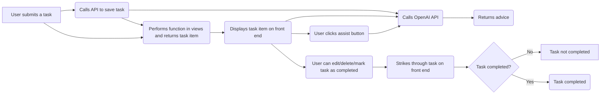

# airbnb-hosptitable-gmail-google-calendar
Takes Airbnb reservation info via Hospitable.com's use of the Airbnb API and sends and email containing info via Hospitable shortcodes sends to Gmail in Subject line and script parses and creates a Google calendar entry

# Django REST Framework API and OpenAI API TODO list with AI Assistance Application

## Distinctiveness and Complexity:

This project stands out from others in the course due to its use of the Django REST framework in conjunction with the OpenAI API for Chat Completion. The Django REST framework is a powerful tool for building RESTful APIs, and I utilized it to create a comprehensive API for the TODO list application. I also utilized the OpenAI API for Chat Completion to provide users with task-specific advice when they click the assist button.

The project's complexity arises from the use of multiple technologies and frameworks. I had to integrate the front end with the backend using the Django framework, and also implement the OpenAI API for Chat Completion. Additionally, I used the Django REST framework to build a robust RESTful API that supports CRUD (Create, Read, Update, Delete) operations on the task items. I believe that the combination of these technologies makes this project unique and challenging.

Below is a flowchart to give you an idea of how the application works:

## Files Created

 - **`api/models.py`** - This file contains the Django Task model with fields for the task title, completion status, and advice.
 - **`api/serializers.py`** - This file contains the serializer classes for the Task model, used to convert data to JSON format for API responses.
 - **`api/views.py`** - This file contains the view functions for the REST API endpoints, which define how data is retrieved, created, updated, or deleted.
 - **`api/urls.py`** - This file contains the URL patterns for the REST API endpoints.
 - **`frontend/templates/frontend/list.html`** - This file is a static HTML template that renders the TODO list on the front end.
 - **`frontend/urls.py`** - This file contains the URL patterns for the front end of the application
 - **`capstone/urls.py`** - This file contains the URL patterns for the API, back and front ends.

## Running the Application

To run the application, follow these steps:

 1. Clone the repository to your local machine.
 2. Install the required Python libraries by running `pip install -r requirements.txt` in your terminal.
 3. Set up the Django database by running `python manage.py migrate` in your terminal.
 4. Run the Django development server with the command `python manage.py runserver`.
 5. Access the application in your web browser at http://127.0.0.1:8000/.

## Additional Information

The API app can be accessed at http://127.0.0.1:8000/api. The API endpoints that the front end can access are:

 - `http://127.0.0.1:8000/api/task-list` - Returns a list of all tasks.
 - `http://127.0.0.1:8000/api/task-detail/<str:pk>` - Returns details of a specific task with the given primary key.
 - `http://127.0.0.1:8000/api/task-create` - Creates a new task.
 - `http://127.0.0.1:8000/api/task-update/<str:pk>` - Updates a specific task my marking complete or incomplete with the given primary key.
 - `http://127.0.0.1:8000/api/task-delete/<str:pk>` - Deletes a specific task with the given primary key.
 - `http://127.0.0.1:8000/api/task-assist/<str:pk>` - Returns advice for the task based on the pre-determined prompts that are set within the taskAssist API view.

The staff should be aware that this project uses OpenAI's API for Chat Completion, which requires an API key to function. In this project, the API key is within the taskAssist API view, but has been removed before submission for security purposes.
